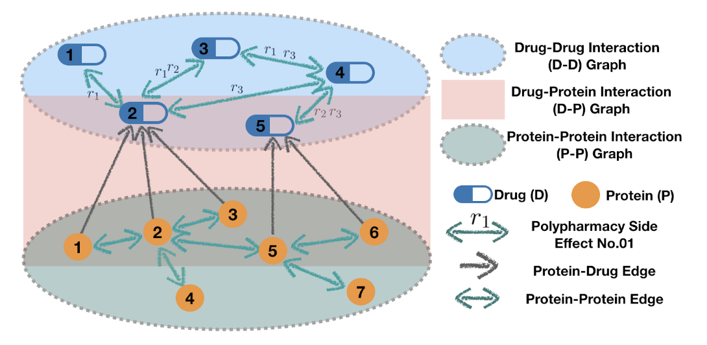
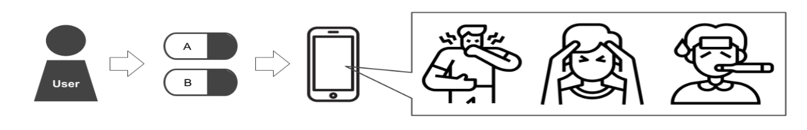

# Prediction of Side Effects Due to Polypharmacy Using Machine Learning

This work was inspired by the [TIP](https://github.com/NYXFLOWER/TIP) project of NYXFLOWER on GitHub and the [Decagon](http://snap.stanford.edu/decagon/) project. This project utilizes machine learning in order to predict the side effects of polypharmacy. If the user inputs the names of two drugs, the program predicts possible side effects that these drugs can bring.

## Background of the Proposal

Currently, South Korea does not have a drug side effect prediction system. It is possible to find the name, efficacy, and side effects of one drug on portal sites such as Naver, but the combination of the two drugs and the side effects that the combination brings are difficult to predict. Therefore, most people have no common sense of side effects when taking more than one drug without the attention of a specialist. This idea was proposed to predict the side effects that people who have underlying diseases or who have medication they usually take (such as contraceptives, depression drugs, diabetes drugs, allergy drugs, etc.) would be wary of when taking more than one drug.

## Overview

Predicting drug side effects through machine learning has not yet been fully implemented despite the very high need. Therefore, this idea has a clear differentiation because it solves frequently occurring problems in a new way. When the user puts two drug names into the system, this app predicts possible side effects through algorithms. 

Machine learning is necessary to identify the interaction and side effects of the two drugs. It is the principle that a computer learns the drugs and side effects of a given dataset and then identifies the interaction of newly input drugs. If this idea is developed and commercialized, accidents caused by ignorance about the side effects of taking two drugs together can be prevented. 

## Prototype Design

### 1. Data Collection

There were multiple drug data sets that could be used for free, but the collection was narrowed down when taking two or more drugs since most drug data sets were structures that contained a detailed explanation of one drug. In order to predict side effects, we needed a dataset connected not only to drugs but also to proteins. In conclusion, we decided to use the data published in [Decagon](https://github.com/mims-harvard/decagon) ([Modeling polypharmacy side effects with graph convolutional networks](https://academic.oup.com/bioinformatics/article/34/13/i457/5045770?login=false)) as it was utilized by other algorithms multiple times and suited our situation. 

### 2. Data Processing

Although there was little to modify because the data set was preprocessed, it needed additional development processes such as data type unification and drug-drug, drug-protein, and protein-protein map separately as it was improved to a more efficient model (described in #3) during development. 

### 3. Algorithm Utilization/Model

#### 3.1 Using the R-GCN model, we predicted the target link (side effect) among the multi-relational links produced by two drug combinations. 

#### 3.2 Because both the Decagon model introduced in the paper and the R-GCN mentioned in 3.1 were all bound to one graph, there was a high computational cost and limits in the memory demand. There was an improved model of tri-graph information propagation for polypharmacy side effect prediction, which was used to significantly modify the code. At this time, the data processing mentioned in #2 was additionally carried out.

#### 3.3 As a result, we were able to complete a model that showed the performance of AUPRC 0.889 AUROC 0.913. 

### 4. User Input

#### 4.1 Using Python and Selenium, we accessed the online DB from which the data set was extracted and developed a function to change it to a drug ID when a user enters a drug name.

#### 4.2 We developed a function that checks whether the model is a combination of drugs studied with the ID obtained in 4.1. If it is, the system implements a method that would reduce time for the prediction, and if it is not, the system would implement an additional learning method according to the model format. 

## Key Technologies and Features

### 1. Development Environment

Our program was developed using Python, MacOS for OS, and PyTorch and PyTorch-Geometric for ML libraries. Because of the limited functions of the laptop, we completed the machine learning using the GPU in Google Collaboration.

### 2. Model Explanation

As explained above, in order to reduce the amount of computation and increase the learning performance, it was important to divide the graph into three equal parts without adding the whole graph. The model is largely divided into the encoder and the decoder, and the detailed description is as follows. The goal is to give a pair of drug combinations to the final drug learned with the encoder so that the target side effect can be calculated as a probability.

#### 2.1 Encoder (Vectorized Graph Structure)
* **Protein-Protein Graph Embedding Module (PPM)**: Implemented as the most basic message passing neural networks (MPNN) framework for GCN. To see the protein-drug interaction, we update the proteins (both themselves and the neighboring nodes) without omission. In consideration of itself and its neighbors, we used two Hidden Layers and ReLU Activation Function. 
* **Graph-to-Graph Information Propagation Module (GGM)**: GGM is a module that connects protein and drug. It is composed of two functions. The first function is to update and embed all drugs that react with protein updated with PPM. It was implemented as 1 layer of MPNN method. The second is the function of updating the responding drug itself. Only Linear Transformation was applied because it handled only itself. Both used ReLU and combined each result in a Concat method.
* **Drug-Drug Graph Embedding Module (DDM)**: Update all drugs associated with the targeted (responsive) drugs. At this time, the R-GCN model was used because there may be several side effects rather than one depending on the drug-drug relationship. To prevent overfitting and reduce complexity, we applied the basis decomposition regulation presented in the paper ([Modeling Relational Data with Graph Convolutional Networks](https://academic.oup.com/bioinformatics/article/34/13/i457/5045770?login=false)).

#### 2.2 Decoder
The necessary parts for predicting side effects are the Edge and Edge labels contained in the D-D graph. Since it is a graph of the Triple (D-E-D) structure, the target side effects were calculated as probabilities by activating with a sigmoid function using DistMult factorization, which can preserve the relationship between the nodes well. 

### 3. General Development
The dataset used for model learning was extracted from the [PubChem](https://pubchem.ncbi.nlm.nih.gov/) online database. Therefore, when the user puts the drug name in the app as an input, the user is changing the drug name to the chem ID using the site above. We used Selenium to do the crawling. We utilized the ID combination to classify whether it was a trained combination or not. 

